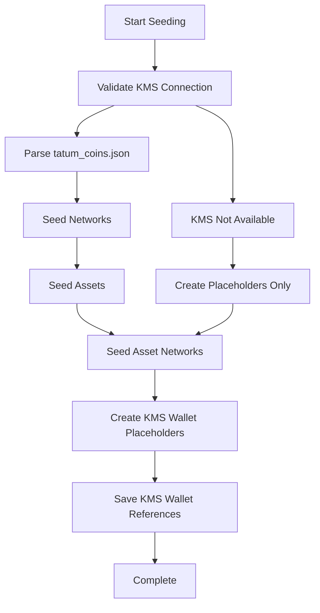

# Professional Database Seeding Guide

## Overview

This guide covers the improved database seeding system for Cryptic Gateway that integrates with your real Tatum KMS Docker setup and properly handles the `tatum_coins.json` data structure.

## 🚀 Quick Start

### 1. Seed Networks and Assets
```bash
# Seed all networks, assets, and create placeholder KMS wallets
npm run db:seed:networks

# Clean up seeded data (if needed)
npm run db:seed:clean
```

### 2. Generate Real KMS Wallets
```bash
# Start KMS Docker container
npm run kms:start

# Generate real KMS wallets to replace placeholders
npm run kms:generate-wallets
```

## 📋 What Gets Seeded

### Networks
- **Bitcoin** (BTC) - UTXO
- **Ethereum** (ETH) - EVM  
- **BNB Smart Chain** (BNB) - EVM
- **Polygon** (MATIC) - EVM
- **TRON** (TRX) - TRON
- **Litecoin** (LTC) - UTXO
- **Dogecoin** (DOGE) - UTXO
- **Bitcoin Cash** (BCH) - UTXO

### Assets
**Native Assets:**
- BTC, ETH, BNB, MATIC, TRX, LTC, DOGE, BCH

**Token Assets:**
- **USDT** (Tether USD) - Available on Ethereum, BSC, TRON, Polygon
- **USDC** (USD Coin) - Available on Ethereum, BSC, Polygon

### Asset Networks
Links assets to their respective networks with proper:
- Contract addresses for tokens
- Decimals configuration
- Token standards (ERC-20, BEP-20, TRC-20)

### KMS Wallets
- Creates placeholder KMS wallet records for each network
- Proper derivation paths for each blockchain type
- Ready for real KMS signature ID replacement

## 🔧 Architecture Improvements

### 1. Professional Error Handling
```typescript
class SeedingError extends Error {
  constructor(message: string, public readonly context?: any) {
    super(message);
    this.name = 'SeedingError';
  }
}
```

### 2. Comprehensive Validation
- Validates `tatum_coins.json` structure
- Filters only public, supported networks
- Handles missing or malformed data gracefully

### 3. KMS Integration Ready
```typescript
interface NetworkConfig {
  code: string;
  name: string;
  type: NetworkType;
  tatumChainId: string;
  nativeAsset: { symbol: string; name: string; decimals: number };
  derivationPath: string;
  blockConfirmations: number;
  kmsChainCode: string; // For KMS wallet generation
}
```

### 4. Token Configuration
```typescript
const POPULAR_TOKENS: TokenConfig[] = [
  {
    symbol: 'USDT',
    name: 'Tether USD',
    decimals: 6,
    logoUrl: '/icons/usdt.svg',
    networks: [
      { networkCode: 'ethereum', contractAddress: '0xdAC17F958D2ee523a2206206994597C13D831ec7', tokenStandard: 'ERC-20' },
      { networkCode: 'bsc', contractAddress: '0x55d398326f99059fF775485246999027B3197955', tokenStandard: 'BEP-20' },
      { networkCode: 'tron', contractAddress: 'TR7NHqjeKQxGTCi8q8ZY4pL8otSzgjLj6t', tokenStandard: 'TRC-20' },
      { networkCode: 'polygon', contractAddress: '0xc2132D05D31c914a87C6611C10748AEb04B58e8F', tokenStandard: 'ERC-20' },
    ],
  },
  // ... more tokens
];
```

## 📊 Seeding Process Flow



## 🔐 KMS Integration

### Placeholder System
The seeding script creates placeholder KMS wallets with:
- Unique placeholder signature IDs
- Proper derivation paths
- `PENDING_SETUP` status

### Real KMS Replacement
After seeding, run the KMS wallet generator to replace placeholders:
```bash
npm run kms:generate-wallets
```

This will:
1. Connect to real Tatum KMS Docker container
2. Generate actual signature IDs and xpubs
3. Update database records with real KMS data
4. Set wallet status to `ACTIVE`

## 📁 Generated Files

### `kms-wallets.json`
Contains mapping of networks to their KMS wallet data:
```json
{
  "bitcoin": {
    "signatureId": "placeholder-bitcoin-1704067200000"
  },
  "ethereum": {
    "signatureId": "placeholder-ethereum-1704067200001"
  }
}
```

## 🛠 Troubleshooting

### Common Issues

1. **KMS Docker Not Running**
   ```bash
   # Start KMS container
   npm run kms:start
   
   # Check logs
   npm run kms:logs
   ```

2. **Database Connection Issues**
   - Verify `.env` file has correct `DATABASE_URL`
   - Ensure PostgreSQL is running
   - Run `npm run db:push` to sync schema

3. **tatum_coins.json Not Found**
   - Ensure file exists at `knowlodge/tatum_coins.json`
   - Verify file is valid JSON format

4. **Seeding Fails Midway**
   ```bash
   # Clean up and retry
   npm run db:seed:clean
   npm run db:seed:networks
   ```

## 🔄 Cleanup and Reset

### Full Reset
```bash
# Clean all seeded data
npm run db:seed:clean

# Re-seed everything
npm run db:seed:networks

# Generate real KMS wallets
npm run kms:generate-wallets
```

### Partial Reset
```bash
# Only clean KMS wallets
npx tsx -e "
import { PrismaClient } from '@prisma/client';
const prisma = new PrismaClient();
await prisma.kmsWallet.deleteMany();
await prisma.\$disconnect();
"
```

## 📈 Next Steps

After successful seeding:

1. **Verify Data**
   - Check dashboard for seeded networks and assets
   - Verify KMS wallets are properly configured

2. **Generate Test Addresses**
   ```bash
   npm run test:unified-wallets
   ```

3. **Start Development**
   ```bash
   npm run dev
   ```

## 🎯 Key Improvements Over Original Script

1. **Real KMS Integration** - Works with actual Tatum KMS Docker
2. **Better Error Handling** - Comprehensive error messages and context
3. **Flexible Architecture** - Supports placeholder → real KMS workflow
4. **Professional Structure** - Clean, maintainable, well-documented code
5. **Validation & Safety** - Proper data validation and rollback mechanisms
6. **Token Support** - Comprehensive token definitions with contract addresses
7. **Network Mapping** - Proper mapping from tatum_coins.json to database schema

This seeding system provides a solid foundation for your Cryptic Gateway project with proper KMS integration and professional-grade error handling.
